# 大無限開運西遊 — 軟體架構與維運交接文件

> **本文件用途**：給接手維運的工程師一份單一、完整、可跳轉的地圖。
> 讀完本文應能回答：「這系統有哪些組件？一筆打卡走過哪些函式？資料庫有多少壓力？哪些地方是先修的資安地雷？」
> **適用版本**：截至 2026-04-18 的 `main` 分支（最近 commit `9301be1`）
> **事實來源**：本文所有敘述對應原始碼路徑與行號；若程式碼修改，請同步更新本文。
> **建議閱讀順序**：第 1 → 2 → 8 → 9 章先看，其餘章節依需要查閱。

---

## 0. 文件總覽

本文分為四大區塊：

| 區塊 | 章節 | 適合場景 |
|---|---|---|
| **基礎** | 1. 系統定位與技術棧｜2. 軟體架構總覽 | 第一次接觸本專案 |
| **結構** | 3. 前端｜4. 後端｜5. 資料層 | 準備修改特定模組 |
| **流程** | 6. 業務流程圖｜7. Function 關係圖 | 追查一筆請求走哪些程式碼 |
| **風險** | 8. 資安｜9. 效能與系統壓力 | 上線前盤點、事故回溯、重構排程 |
| **運維** | 10. 部署與環境｜11. 維運常見任務｜12. 技術債 | 日常維運 |

所有檔案路徑皆以 **Markdown 連結** 呈現，於 VSCode 內可直接點擊跳轉。

---

## 1. 系統定位與技術棧

### 1.1 業務定位

**大無限開運西遊** 是「2026 大無限開運親證班」線下共修課程的**遊戲化打卡後台**。學員（同時也是西遊角色：孫悟空／豬八戒／沙悟淨／白龍馬／唐三藏）每天打卡定課、每週參加特殊副本、在六角地圖上移動、與「心魔」戰鬥、購買法寶、向隊友捐骰。系統以「共修紀律」為內核，以「RPG 進度」為外殼，設計原則在 [docs/GAME_DESIGN.md](./GAME_DESIGN.md) 與 [docs/MAP_DESIGN.md](./MAP_DESIGN.md) 中為權威來源。

### 1.2 技術棧

| 類別 | 技術 | 版本 | 角色 |
|---|---|---|---|
| 框架 | Next.js | 16.1.6 | App Router + Server Actions |
| UI | React | 19.2.3 | 客戶端渲染，單頁巨石架構 |
| 型別 | TypeScript | 5.x | 全面啟用 |
| 樣式 | Tailwind CSS | 4 | 首要 UI 樣式 |
| 資料庫 | PostgreSQL（Supabase 託管） | — | 主要資料儲存 |
| DB 客戶端 A | `@supabase/supabase-js` | 2.95.2 | 無交易需求的讀寫、RPC 呼叫 |
| DB 客戶端 B | `pg` (node-postgres) | 8.18.0 | 需要顯式交易（BEGIN/COMMIT）的場景 |
| AI | `@google/genai`（Gemini 2.0/2.5 Flash） | 1.43.0 | 週評語與隊長簡報 |
| 訊息 | `@line/bot-sdk` | 10.6.0 | LINE OAuth 登入、訊息 webhook |
| 掃碼 | `html5-qrcode` / `react-qr-code` | — | 課程 QR Code 掃描與顯示 |
| 分析 | `@vercel/analytics` | 2.0.1 | 流量觀測 |
| 時間 | `date-fns` | 4.1.0 | logical date 運算、格式化 |
| 圖示 | `lucide-react` | 0.563.0 | 全站 SVG icon |
| Google API | `googleapis` | 171.4.0 | （既存）第三方資料同步用 |
| 環境變數 | `dotenv` | 17.3.1 | 本地 script 載入 `.env.local` |
| 部署 | Vercel | — | Fluid Compute（Node.js 24 LTS） |

### 1.3 執行環境前提

```bash
npm run dev      # 開發伺服器 localhost:3000
npm run build    # 生產建置
npm run lint     # ESLint 檢查
```

**沒有測試框架**，所有驗證靠手動瀏覽器操作。這是本專案最顯著的維運風險之一（詳見第 12 章）。

---

## 2. 軟體架構總覽

### 2.1 分層圖

```mermaid
flowchart TB
    subgraph Client["瀏覽器端（Client Bundle）"]
        PAGE["app/page.tsx<br/>1925 行單頁巨石<br/>~52 useState"]
        TABS["components/Tabs/*<br/>10 個分頁"]
        MAP["components/Map/WorldMap.tsx<br/>135 KB 六角地圖"]
        ADMIN["components/Admin/*<br/>10 個管理模組"]
    end

    subgraph Edge["Next.js Server（Vercel Fluid Compute）"]
        APIROUTES["app/api/*<br/>LINE OAuth、Webhook、Cron"]
        ACTIONS["app/actions/*<br/>19 個 Server Actions"]
    end

    subgraph Data["資料與外部服務"]
        PG[("Supabase PostgreSQL<br/>（pg Pool max=5）")]
        SUPA[("Supabase JS SDK<br/>RPC + REST")]
        GEM["Gemini API<br/>2.0/2.5 Flash"]
        LINE["LINE Messaging API"]
    end

    PAGE -->|action call| ACTIONS
    TABS --> PAGE
    MAP --> PAGE
    ADMIN -->|admin actions| ACTIONS
    APIROUTES --> ACTIONS
    ACTIONS -->|lib/db.ts| PG
    ACTIONS -->|@supabase/supabase-js| SUPA
    SUPA --> PG
    ACTIONS -->|@google/genai| GEM
    APIROUTES -->|webhook / OAuth| LINE
```

### 2.2 資料存取決策流程

整個專案最核心的規則是 **何時用 pg、何時用 Supabase**。這張圖是第一天就要背起來的心法：背後的設計初衷是：**涉及金錢/資源的跨表一致性用 pg 交易、其餘一律走 Supabase 或 RPC**。若看到新功能違反這個原則（例如用 Supabase 直接寫兩張有關聯的表），幾乎可以肯定是將來某次資料不一致事故的根源，應在 code review 時擋下。

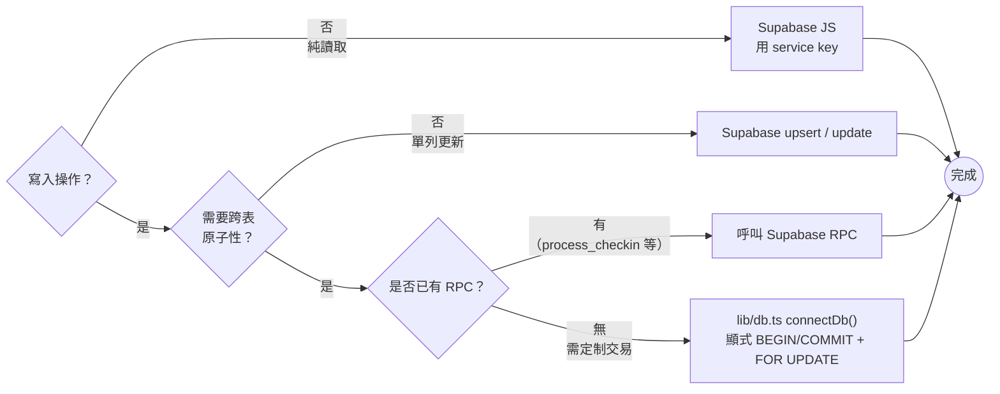

**目前採用三種模式**：

1. **`pg` 顯式交易**：`app/actions/quest.ts`（早期）、[app/actions/store.ts](../app/actions/store.ts)、[app/actions/admin.ts](../app/actions/admin.ts)。用於法寶購買、金幣轉移、名冊匯入等需要多表鎖定的操作。
2. **Supabase RPC**：[app/actions/quest.ts](../app/actions/quest.ts)、[app/actions/combat.ts](../app/actions/combat.ts)、[app/actions/dice.ts](../app/actions/dice.ts)。RPC 由 `supabase/migrations/*.sql` 定義為 PL/pgSQL，交易在資料庫端完成，速度最快。
3. **Supabase 直接 upsert/update**：[app/actions/map.ts](../app/actions/map.ts)、[app/actions/items.ts](../app/actions/items.ts)、[app/actions/course.ts](../app/actions/course.ts) 等。用於單列更新或冪等 upsert。

---

## 3. 前端架構

### 3.1 `app/page.tsx` 單頁巨石

**這是整個專案最沉重的檔案**：1925 行，全部是客戶端組件（`"use client"`）。[CLAUDE.md](../CLAUDE.md) 明言「不要把它拆成多路由」。維運時**修改此檔要格外謹慎**——它擁有全域狀態、4 階段資料載入、10 個 tab 的資料管道（若日後新增 tab，[CLAUDE.md](../CLAUDE.md) 的 tab 列表也要同步）。

**狀態分組**（useState ~52 個，以 2026-04-18 `main` 分支計）：

| 狀態群 | 代表欄位 | 用途 |
|---|---|---|
| 視圖與導覽 | `view`、`activeTab`、`gmViewMode` | 登入/註冊/遊戲/管理員/地圖 |
| 使用者 | `userData`、`adminAuth`、`adminActorName` | 身份與權限 |
| 遊戲資料 | `logs`、`leaderboard`、`topicHistory`、`temporaryQuests` | 日課紀錄與排行 |
| 系統設定 | `systemSettings` | 全域 key-value 設定 |
| 地圖狀態 | `mapData`、`mapEntities`、`teamSettings`、`stepsRemaining`、`isRolling`、`showPortalModal` | 冒險模式 |
| W4 與審核 | `w4Applications`、`pendingW4Apps`、`squadApprovedW4Apps` | 傳愛分數三段審核 |
| AI 內容 | `weeklyReview`、`aiBriefing`、`isLoadingReview`、`isLoadingBriefing` | Gemini 產出 |
| 成就與試煉 | `userAchievements`、`peakTrials`、`achievementQueue` | 成就推播佇列 |

### 3.2 四階段資料載入

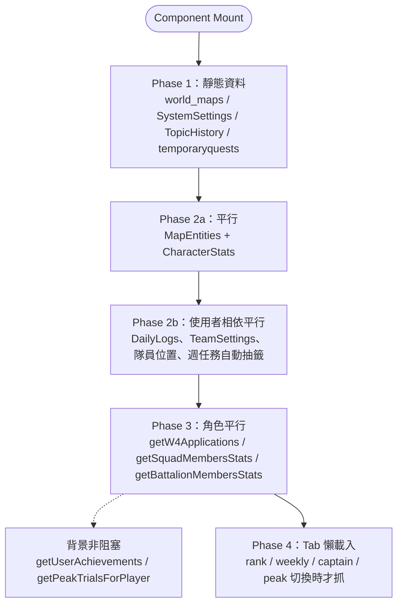

近期 commit `9301be1` 即是在 Phase 2b 把隊伍資料抓取包成 `Promise.all`，顯示**平行化是已進行中的優化主軸**。

### 3.3 元件目錄

```
components/
├── Tabs/                      10 個分頁
│   ├── DailyQuestsTab.tsx      178  日課打卡按鈕、撤銷
│   ├── WeeklyTopicTab.tsx      320  W4 提交、AI 簡報
│   ├── StatsTab.tsx             92  六維統計
│   ├── RankTab.tsx             187  修為榜
│   ├── ShopTab.tsx             296  法寶藏寶閣
│   ├── AchievementsTab.tsx     131  成就格
│   ├── CourseTab.tsx           401  課程註冊、QR、志工掃碼
│   ├── PeakTrialTab.tsx        470  試煉報名
│   ├── CaptainTab.tsx          557  隊長工具
│   └── CommandantTab.tsx       184  營長審核
├── Map/
│   ├── WorldMap.tsx          135KB  六角地圖繪製、戰鬥整合
│   └── WorldOverview.tsx      23KB  迷你地圖
├── Admin/                   AdminDashboard + 10 模組
├── Login/                   LoginForm、RegisterForm
├── Layout/                  Header
├── MapEditor/               管理員地圖編輯
└── AchievementIcon.tsx
```

所有 tab **皆用 `next/dynamic` 動態載入、關閉 SSR**，因此首次切換到某 tab 前不會拉取該 tab 的 JS。

### 3.4 WorldMap 內部架構（次級巨石）

[components/Map/WorldMap.tsx](../components/Map/WorldMap.tsx) 共 2123 行、73 處 React hooks，是僅次於 `page.tsx` 的第二個**巨型客戶端組件**。它獨立持有地圖視圖、戰鬥模組、骰子動畫、陷阱/寶箱互動，與 `page.tsx` 以 props + callback 雙向同步。

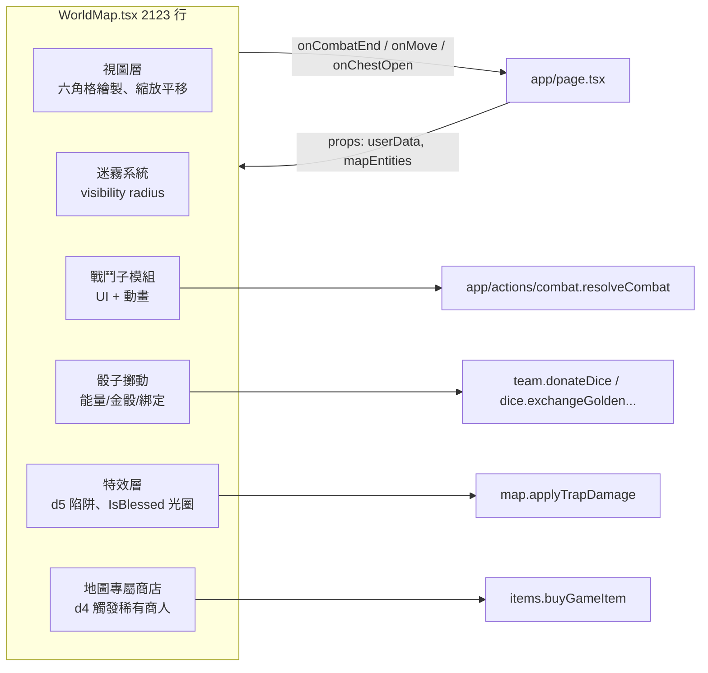

**維運提醒**：
1. WorldMap 若要拆解，建議**先抽出「戰鬥模組」為獨立 `<Combat />`**，因為它是最獨立、邏輯最重的子系統。其餘（視圖、迷霧、特效）彼此耦合高，貿然拆會造成大量 props drilling。
2. 2123 行中的 `useEffect` 依賴列表是改動熱區，任何對 `mapEntities` 物件參照的錯誤重建都會觸發全地圖重繪。新增 state 前先觀察有無可用的既有 memoized selector。

### 3.5 App 路由（非主單頁）

| 路徑 | 用途 |
|---|---|
| `app/api/auth/line/*` | LINE OAuth 起點與 callback |
| `app/api/webhook/line/route.ts` | LINE 訊息 webhook（見證心得提交） |
| `app/api/cron/auto-draw/route.ts` | Vercel Cron：每週一中午自動抽籤（驗 `CRON_SECRET`） |
| `app/api/cron/w3-fine/route.ts` | Vercel Cron：W3 罰金合規檢查 |
| `app/api/admin/local-images/route.ts` | 怪物圖檔上傳下載 |
| `app/api/admin/monopoly-settings/route.ts` | 難度調參 |
| `app/class/b`, `app/class/c`, `app/class/checkin` | 獨立課程打卡頁（舊版，仍可用） |
| `app/admin/page.tsx` | 管理員儀表板入口（受密碼閘道保護） |
| `app/map/page.tsx` | 獨立地圖頁（從主頁「啟動冒險」進入） |

---

## 4. 後端（Server Actions）架構

### 4.1 19 個 Server Actions 分類表

| 領域 | 檔案 | 行數 | DB 模式 | 主要匯出 |
|---|---|---|---|---|
| 打卡 | [quest.ts](../app/actions/quest.ts) | 148 | Supabase RPC | `processCheckInTransaction`、`processUndoTransaction` |
| 店舖 | [store.ts](../app/actions/store.ts) | 171 | pg 交易 | `purchaseArtifact`、`transferCoinsToTeam` |
| 戰鬥 | [combat.ts](../app/actions/combat.ts) | 454 | Supabase RPC | `resolveCombat` |
| 地圖 | [map.ts](../app/actions/map.ts) | 221 | Supabase | `handleChestOpen`、`applyTrapDamage`、`handleMimicTerrain` |
| 骰子 | [dice.ts](../app/actions/dice.ts) | 63 | RPC | `transferGoldenDiceToTeam`、`exchangeGoldenDiceToEnergy`、`blessChestWithGoldenDice` |
| 隊伍 | [team.ts](../app/actions/team.ts) | 357 | Supabase + RPC | `drawWeeklyQuestForSquad`、`donateDice`、`getSquadMembersStats`、`getBattalionMembersStats` |
| 道具 | [items.ts](../app/actions/items.ts) | 225 | Supabase | `buyGameItem`、`useGameItem`、`pushMonsterByFan` |
| AI | [gemini.ts](../app/actions/gemini.ts) | 320 | Gemini API | `generateWeeklyReview`、`generateCaptainBriefing` |
| 管理員 | [admin.ts](../app/actions/admin.ts) | 777 | pg + Supabase | `triggerWeeklySnapshot`、`importRostersData`、`logAdminAction`、`getGMUserByUID` |
| 課程 | [course.ts](../app/actions/course.ts) | 154 | Supabase | `registerForCourse`、`markAttendance`、`getCourseList` |
| 罰金 | [fines.ts](../app/actions/fines.ts) | 270 | RPC | `recordFinePayment`、`getSquadFineStatus` |
| 傳愛 | [w4.ts](../app/actions/w4.ts) | 213 | Supabase | `submitW4Application`、`getW4Applications` |
| 成就 | [achievements.ts](../app/actions/achievements.ts) | 512 | Supabase | `checkAndUnlockAchievements`、`getUserAchievements` |
| 試煉 | [peakTrials.ts](../app/actions/peakTrials.ts) | 153 | Supabase | 巔峰試煉查詢與統計 |
| 試煉（舊名） | [peak_trial.ts](../app/actions/peak_trial.ts) | 149 | Supabase | 舊入口（請勿於新代碼新增參照，統一用 `peakTrials.ts`） |
| 技能 | [skills.ts](../app/actions/skills.ts) | 187 | Supabase | 技能進度與法寶使用 |
| 玩家 | [player.ts](../app/actions/player.ts) | 96 | Supabase | 位置儲存等 |
| 見證 | [testimony.ts](../app/actions/testimony.ts)、[testimonies_admin.ts](../app/actions/testimonies_admin.ts) | 44 / 22 | Supabase | 見證心得提交與管理 |

### 4.2 交易邊界與 RPC

**使用 pg 顯式交易的場景**（請務必維持此模式）：
- **法寶購買**（`store.ts`）：要鎖 `CharacterStats` 與 `TeamSettings` 兩列、檢查互斥、發放回溯經驗。
- **名冊匯入**（`admin.ts::importRostersData`）：批次 UPSERT 且需回滾。
- **週快照**（`admin.ts::triggerWeeklySnapshot`）：計算統計 + 寫入 `SystemSettings`。

**使用 RPC 的場景**：
- `process_checkin` / `process_undo`：打卡核心。封裝「獎勵上限、經驗倍率、升級計算、六維成長、骰子發放、金幣結算、法寶檢查」一整套邏輯，保證單次資料庫呼叫完成。
- `add_combat_rewards`：戰鬥結算（扣 HP、加金幣、加骰、團隊分潤 20%）。
- `transfer_dice` / `transfer_golden_dice`：骰子轉移（防止自己轉給自己、餘額不足）。
- `exchange_golden_to_energy_dice`：金骰 1:3 換能量骰、上限 100。
- `global_dice_bonus`：全服每位玩家 +N 骰（戰鬥 5% 觸發）。
- `record_fine_payment`：罰金計數更新。

### 4.3 [lib/db.ts](../lib/db.ts) pg Pool 設定

```ts
max: 5                            // Supabase 免費方案安全值
idleTimeoutMillis: 10_000         // 比 pgBouncer 30s 早釋放
connectionTimeoutMillis: 15_000   // 快速失敗
keepAlive: true                   // 保持連線熱機
```

兩次重試：遇到 timeout/ETIMEDOUT/ECONNREFUSED 時會再試一次後拋錯。所有使用 pg 的 action 必須遵守：

```ts
const client = await connectDb();
try { await client.query('BEGIN'); ... await client.query('COMMIT'); }
catch { await client.query('ROLLBACK'); throw; }
finally { await client.end(); }   // 實際是 release()
```

---

## 5. 資料層與 RPC

### 5.1 核心資料表

| 表 | PK | 重要欄位 |
|---|---|---|
| `CharacterStats` | UserID | Level、Exp、Coins、GameGold、EnergyDice、GoldenDice、Spirit/Physique/Charisma/Savvy/Luck/Potential、HP、CurrentQ/R、TeamName、Inventory(jsonb)、GameInventory(jsonb)、Streak、LastCheckIn、IsCaptain、IsGM、IsBlessed |
| `DailyLogs` | id | Timestamp、UserID、QuestID、QuestTitle、RewardPoints |
| `TeamSettings` | team_name | team_coins、mandatory_quest_id、quest_draw_history(jsonb)、inventory(jsonb)、d7_activated_at |
| `MapEntities` | id | q、r、type、name、data(jsonb: hp, level, zone, traits, expiresAt)、is_active |
| `SystemSettings` | SettingName | Value(jsonb) — 全域 key/value |
| `W4Applications` | id | user_id、interview_target、interview_date、status(pending/squad_approved/approved/rejected)、quest_id |
| `CourseRegistrations` / `CourseAttendance` | UUID | user_id、course_key、(checked_in_by)、created_at |
| `WeeklyReviews` | (user_id, week) | content(jsonb) — Gemini 快取 |
| `Achievements` | (user_id, achievement_id) | unlocked_at |
| `FinePaymentRecords` | id | user_id、amount、paid_to_captain_at、submitted_to_org_at |
| `AdminActivityLog` | id | action、actor、target、details(jsonb)、result、timestamp |

### 5.2 RPC 函式（都在 `supabase/migrations/`）

| RPC | 輸入 | 用途 |
|---|---|---|
| `process_checkin` | (user, quest, title, reward, dice, logical_today) | 打卡全流程 |
| `process_undo` | 同上 | 撤銷 |
| `add_combat_rewards` | (user, exp, coins, dice, golden, hp, gamegold, team, team_bonus) | 戰鬥結算 |
| `transfer_dice` | (from, to, amount) | 能量骰轉移 |
| `transfer_golden_dice` | (from, to, amount) | 金骰轉移 |
| `exchange_golden_to_energy_dice` | (user) | 1 金骰 → 3 能量骰 |
| `global_dice_bonus` | (amount) | 全服骰子 |
| `record_fine_payment` | (captain, target, amount, period, paid_at) | 罰金原子更新 |

### 5.3 索引策略

遷移檔中已建立的主要索引包含 `idx_dailylogs_userid_date`、`idx_dailylogs_userid_timestamp`、`idx_mapentities_active_pos`、`idx_charstats_team`、`idx_achievements_userid`。**注意：`DailyLogs` 與 `FinePayments` 存在重複索引定義**，長期看會拖慢寫入（詳見第 9 章）。

### 5.4 資料欄位的潛規則

本系統的資料模型有幾個「看起來奇怪但刻意如此」的設計，維運時不要擅自修正：

1. **`CharacterStats.Inventory` 與 `GameInventory` 都是 `jsonb` 陣列**：不用關聯表是為了減少連接查詢。新增法寶只要 push 字串 id。**切勿改為多對多關聯**，會牽動全站。
2. **`TeamSettings.quest_draw_history` 以 jsonb 陣列累積週任務**：判斷「本週是否已抽」要掃陣列末端的日期；當陣列長度等於 21（全部 q 任務抽完）時重置。
3. **`SystemSettings` 為垂直 key-value 表**：新增全域設定只要往表塞 `SettingName` 即可；[app/page.tsx:1258](../app/page.tsx#L1258) 附近有明確列出要載入哪些 key，**新 key 必須加入該清單否則前端讀不到**（CLAUDE.md 已警告，但其中寫的行號為舊版，請以本文為準）。
4. **`MapEntities.data` 是 jsonb**：怪物 HP、等級、zone、行為旗標都在裡面，因此 `UPDATE` 必須用 `jsonb_set` 或整包 patch，不能改個欄位就 over-write 全 data。
5. **所有「時間」欄位用 ISO 8601 字串**：前端 `new Date()` 相容、PostgreSQL timestamptz 儲存。伺服器都以 UTC 處理，僅在 [lib/utils/time.ts](../lib/utils/time.ts) 轉台北時區計算 logical date。

---

## 6. 業務流程圖

### 6.1 每日打卡（最核心流程）

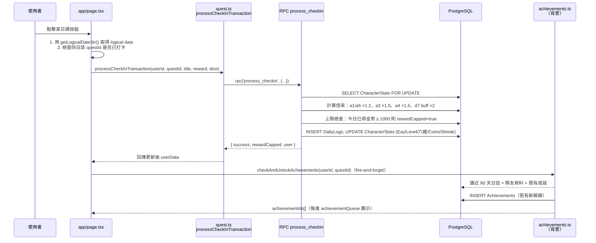

### 6.2 戰鬥結算（DDA + 連擊 + 分潤）

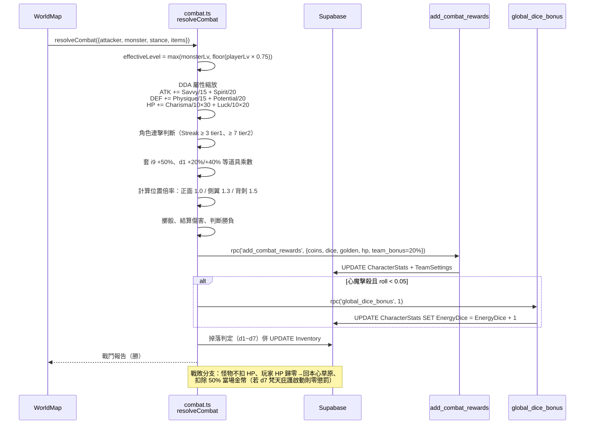

### 6.3 地圖移動與寶箱

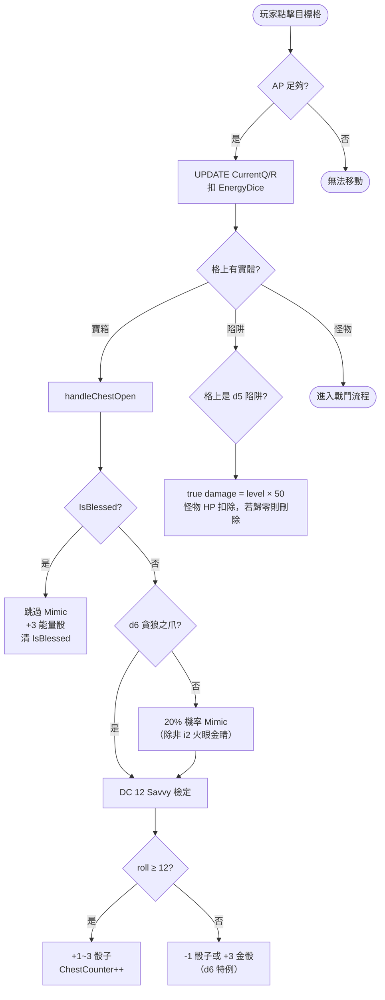

### 6.4 陷阱與詛咒（zone curse）

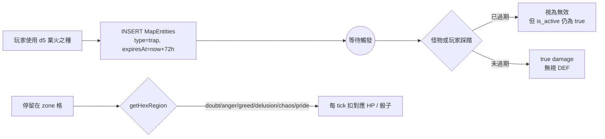

### 6.5 W4 傳愛分數三段審核

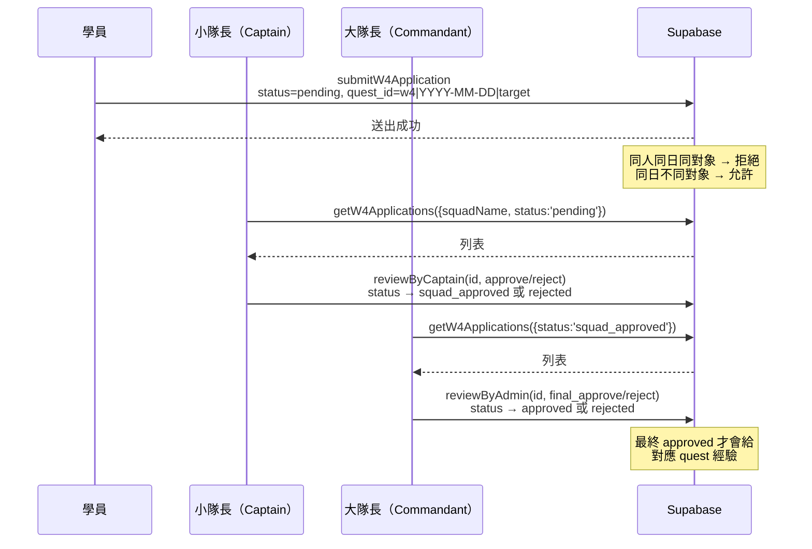

### 6.6 店舖購買（pg 顯式交易）

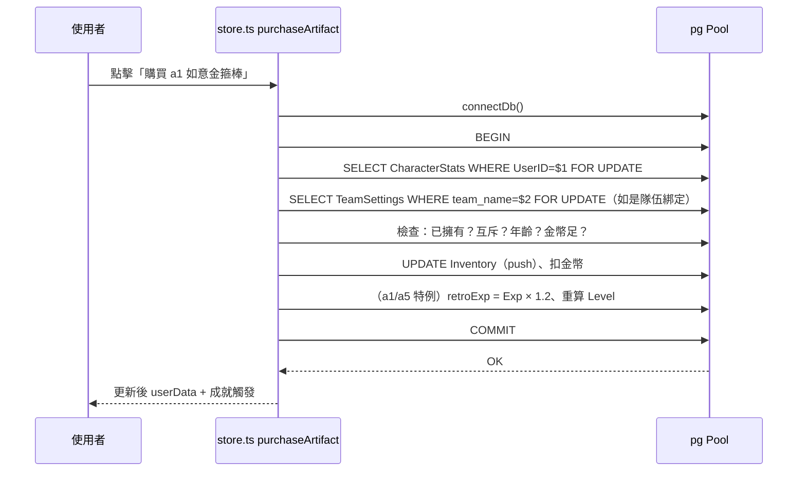

### 6.7 課程 QR 流程

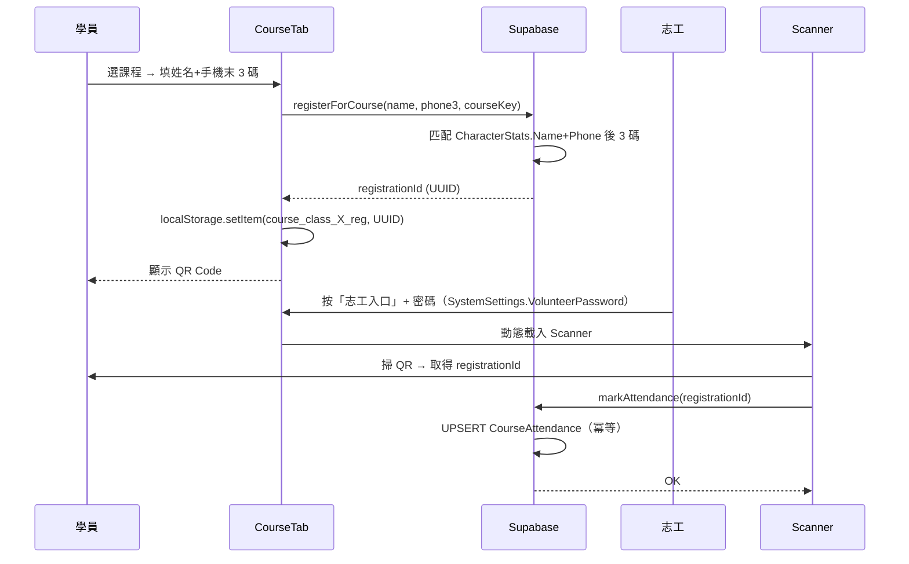

### 6.8 成就解鎖（背景）

```mermaid
flowchart LR
    A[打卡成功] --> B[fire-and-forget 呼叫<br/>checkAndUnlockAchievements]
    B --> C[並行抓取<br/>CharacterStats / 近 90 天 DailyLogs / 現有 Achievements / 隊員資料]
    C --> D[評估 43 條件（定課/協作成就）<br/>含連擊、團隊同步、角色專屬<br/>地圖成就另 40 個，全系統共 83 個]
    D --> E{有新解鎖?}
    E -->|是| F[INSERT Achievements]
    F --> G[回傳 newIds[]]
    G --> H[page.tsx 推進<br/>achievementQueue 顯示彈窗]
    E -->|否| Z([結束])
```

### 6.9 管理員週快照（難度 DDA）

```mermaid
flowchart LR
    A[管理員按「每週業力結算」] --> B[triggerWeeklySnapshot]
    B --> C[統計近 7 日 DailyLogs<br/>activeCount = distinct UserID<br/>questCount = total q1~q7 紀錄]
    C --> D[rate = questCount / (activeCount × 21)]
    D --> E{rate}
    E -->|> 80%| F[WorldState = 'good'<br/>訊息：世界安樂]
    E -->|50–80%| G[WorldState = 'normal']
    E -->|< 50%| H[WorldState = 'bad'<br/>訊息：心魔滋生]
    F --> I[UPSERT SystemSettings]
    G --> I
    H --> I
    I --> J[logAdminAction<br/>（AdminActivityLog）]
```

### 6.10 LINE 登入與帳號綁定

本系統採 **LINE Login** 做身份驗證。流程分兩態：首次登入「綁定」（把 LINE userId 寫回 `CharacterStats.LineUserId`），之後登入則以 LINE userId 反查帳號。回呼一律走 `/api/auth/line/callback` 並以 `state` 字串區分。

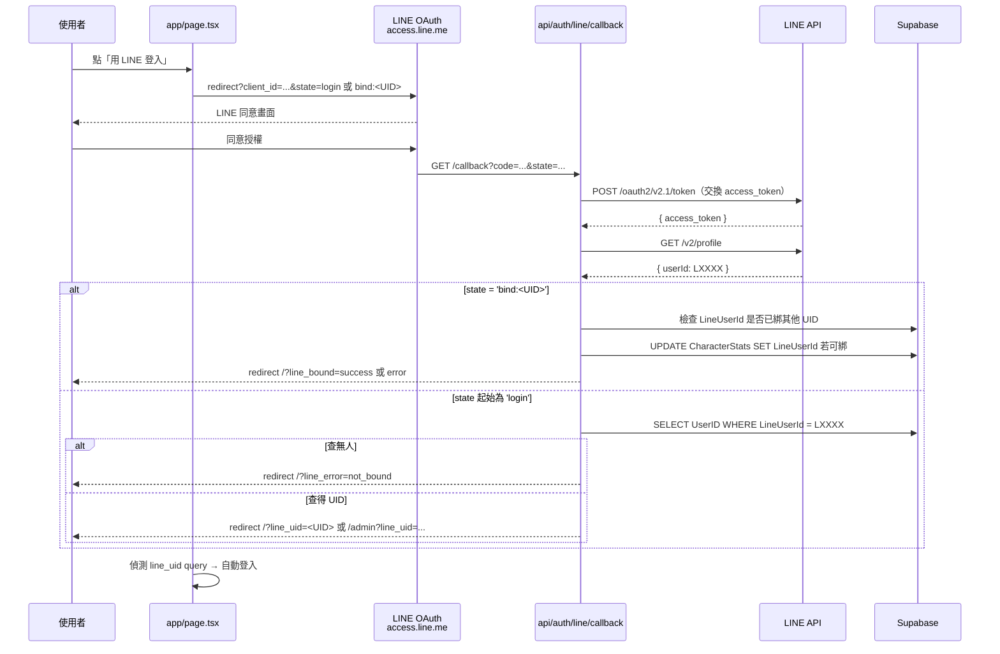

**注意事項**：
- `state` 沒有 CSRF random token，雖有身份認證但缺乏 session 綁定；若擴展至公開流量應補強。
- `NEXT_PUBLIC_APP_URL` 在 Vercel 上不能是 Preview Deployment 的動態網址（LINE 後台 callback URL 白名單需精確匹配），本地開發需改用 ngrok 或跳過 LINE 綁定直接輸入 UserID。
- 登出未清 LINE session（LINE 預設記住授權），屬可接受的 UX 設計但請記在文件。

### 6.11 LINE Webhook → 親證見證心得

LINE 群組訊息由學員傳送，LINE Platform 推送至 `/api/webhook/line`。Webhook 驗證 `x-line-signature` 後解析訊息類型，將符合格式的見證心得寫入 `Testimonies` 表，並由管理員在審核中心進行審核。

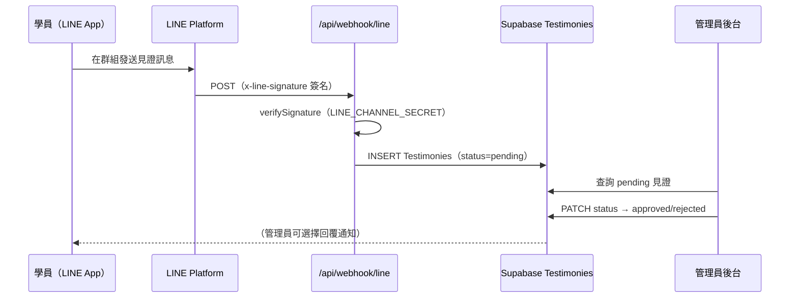

**相關檔案**：  
- `app/api/webhook/line/route.ts` — 簽名驗證與訊息解析  
- `app/actions/testimony.ts` — 學員見證提交  
- `app/actions/testimonies_admin.ts` — 管理員審核（注意：第 20 行若 DB 錯誤會 throw，資訊含 `error.message`）  
- 詳細設計見 [LINE_BOT.md](./LINE_BOT.md)

---

## 7. Function 關係圖（分領域）

### 7.1 quest 領域

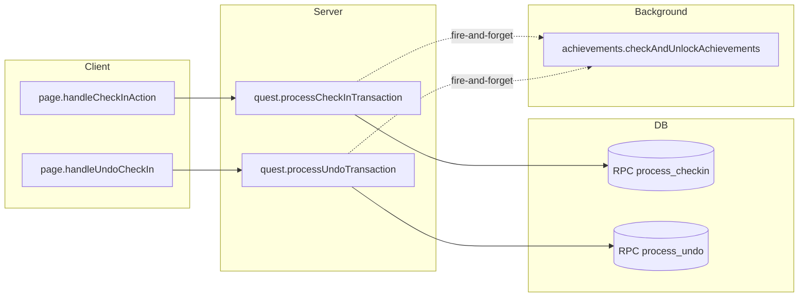

### 7.2 combat 領域

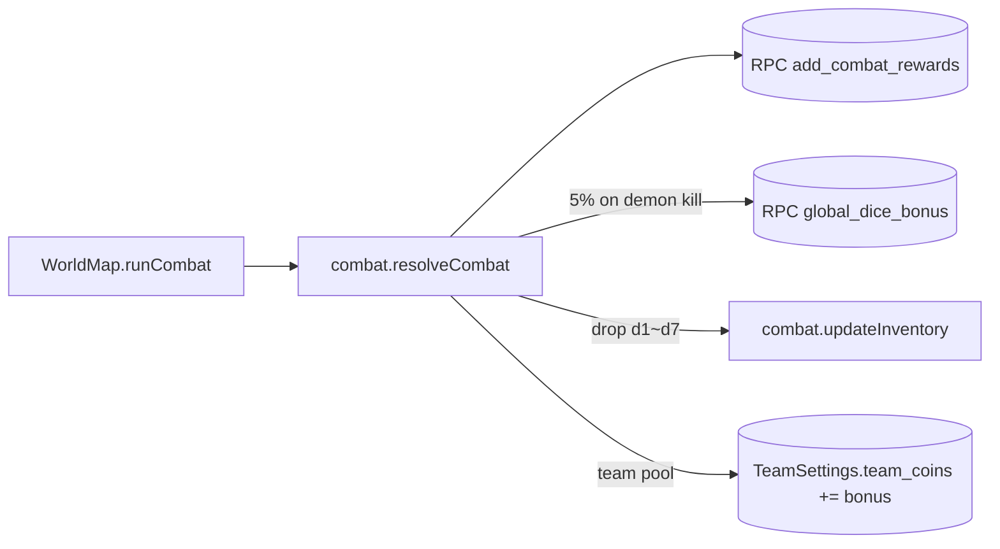

### 7.3 map 領域

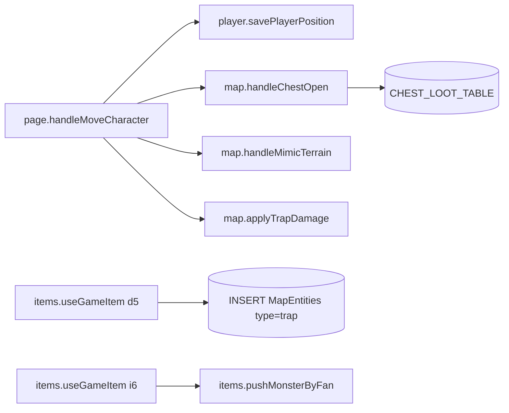

### 7.4 store / dice 領域

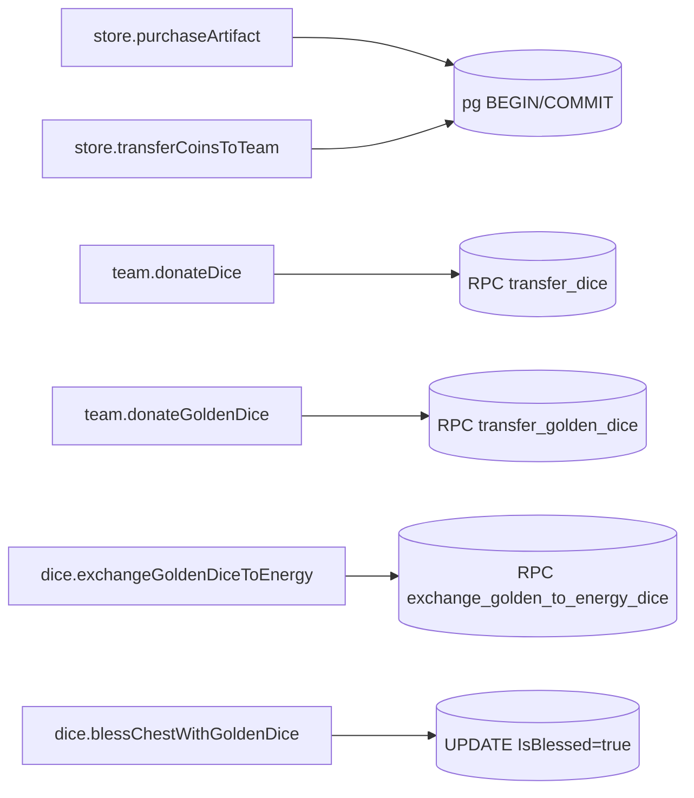

### 7.5 team / admin 領域

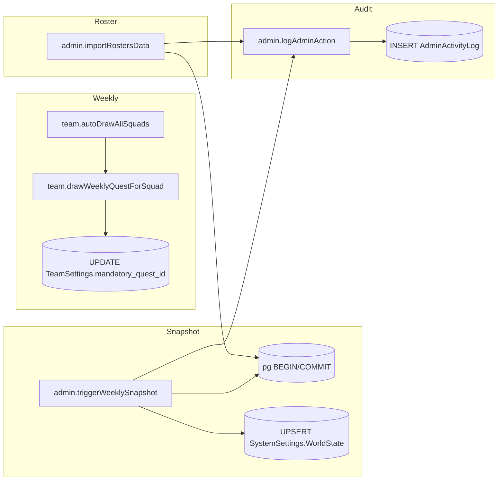

### 7.6 gemini / w4 / course 領域

```mermaid
graph LR
    subgraph AI
        gwr[gemini.generateWeeklyReview]
        gcb[gemini.generateCaptainBriefing]
    end
    gwr --> cacheTbl[(WeeklyReviews upsert)]
    gwr --> gAPI[[Gemini 2.0 Flash]]
    gcb --> gAPI25[[Gemini 2.5 Flash]]
    subgraph W4
        sw[w4.submitW4Application] --> w4Tbl[(INSERT W4Applications)]
        gwa[w4.getW4Applications]
    end
    subgraph Course
        rfc[course.registerForCourse] --> crTbl[(INSERT CourseRegistrations)]
        ma[course.markAttendance] --> caTbl[(UPSERT CourseAttendance)]
    end
```

---

## 8. 資安風險（重點）

> 以下所有項目已在 [main 分支](../) 驗證過檔案與行號。每一條都附**具體修補建議**。

### 8.1 🔴 嚴重（上線前必修）

#### 8.1.1 硬編碼管理員密碼

**位置**：[lib/constants.tsx:94](../lib/constants.tsx#L94)
```ts
export const ADMIN_PASSWORD = "123";
```

**風險**：此常數會**打包進前端 bundle**，任何人開 DevTools → Sources 即可讀取。這實質上等於沒有密碼防護。

**修補**：
1. 立即刪除 `ADMIN_PASSWORD` 常數。
2. 在 [app/page.tsx:226](../app/page.tsx#L226) 改為純粹依賴 `userData.IsGM`（已透過 LINE OAuth 驗證身份）。
3. 若仍需「管理員模式」多一層確認，改為 server action 端的 TOTP 驗證或 LINE 通知內的臨時一次性密碼。

#### 8.1.2 SERVICE_ROLE_KEY 靜默降級 ✅ 已修復

> **已於 2026-04-18 修復**：建立 [lib/supabaseAdmin.ts](../lib/supabaseAdmin.ts) 統一 admin client，Key 缺失時立即拋錯。原 13 個 action 檔的 inline fallback 已全數移除。

~~**位置**：`items.ts`、`team.ts`、`admin.ts`、`achievements.ts`、`player.ts`、`peak_trial.ts` 等 13 個 server action~~

**已修復模式**（[lib/supabaseAdmin.ts](../lib/supabaseAdmin.ts)）：
```ts
const key = process.env.SUPABASE_SERVICE_ROLE_KEY;
if (!key) throw new Error('[supabaseAdmin] 缺少 SUPABASE_SERVICE_ROLE_KEY');
export const supabaseAdmin = createClient(url, key);
```

所有 server action 改為：
```ts
import { supabaseAdmin } from '@/lib/supabaseAdmin';
// 或
import { supabaseAdmin as supabase } from '@/lib/supabaseAdmin';
```

**風險說明（已消除）**：原先當環境變數遺失或拼錯，程式不噴錯而靜默降級到 anon key，造成「使用者感覺成功但資料沒存」的詭異 bug。現在啟動時 fail-fast。

#### 8.1.3 密碼驗證早於權限驗證

**位置**：[app/page.tsx:226](../app/page.tsx#L226)
```ts
if (password !== ADMIN_PASSWORD) { ...error... return; }
if (!userData?.IsGM) { ...error... return; }
```

**風險**：順序錯誤導致無權使用者反而能得知「密碼正確與否」的側通道訊息。一般應先驗身份、再驗輸入。

**修補**：配合 8.1.1，直接改為單一的 `userData.IsGM` 檢查。

### 8.2 🟡 中度（排程修補）

#### 8.2.1 錯誤訊息外洩

管理員 action 多處直接把 `error.message` 回傳客戶端（如 [admin.ts:307](../app/actions/admin.ts#L307)、[:390](../app/actions/admin.ts#L390)、[:481](../app/actions/admin.ts#L481)、[:540](../app/actions/admin.ts#L540)、[:552](../app/actions/admin.ts#L552)、[:559](../app/actions/admin.ts#L559)，另有 10+ 處類似模式；[fines.ts](../app/actions/fines.ts) 多處；[testimonies_admin.ts:20](../app/actions/testimonies_admin.ts#L20) 則以 `throw new Error(error.message)` 形式讓整個 RSC 錯誤傳回客戶端）。可能洩漏資料表名、約束名、連線字串片段。

**修補**：server side `logAdminAction(..., { errorDetails: err.message })` 留存、客戶端只回 `{ success:false, error:'操作失敗（#<uuid>）' }`。

#### 8.2.2 無速率限制

**所有 server actions 都可被高頻呼叫**。打卡、購買、W4 送出、骰子捐贈、管理員快照皆無保護。

**修補**：用 Upstash Redis 或 Vercel KV 針對「敏感動作」加 per-user 限制：打卡每分鐘 10 次、購買每分鐘 5 次、管理員快照每小時 1 次。

#### 8.2.3 背景成就檢查吞錯

[app/actions/quest.ts](../app/actions/quest.ts) 的
```ts
checkAndUnlockAchievements(userId, questId).catch(err => console.error(...))
```
若 DB 暫時異常，使用者會漏掉成就且不知情。

**修補**：建一張 `AchievementCheckRetryQueue`，失敗的 userId 進 queue，Cron 每 10 分鐘重跑。

#### 8.2.4 `SELECT *` 濫用

[store.ts](../app/actions/store.ts)、[admin.ts](../app/actions/admin.ts)、`w4.ts`、`combat.ts` 多處。若新增含密/PII 欄位，會默默隨 action 回傳。

**修補**：全面改為明確欄位清單；TypeScript 可靠 Supabase 型別生成輔助。

#### 8.2.5 客戶端攻擊面過大

`app/page.tsx` 1925 行中包含全部管理員邏輯、AI 摘要、W4 審核。若任一 tab 的字串渲染不慎（如 [Gemini 產出內容](../app/actions/gemini.ts)）被注入 HTML，可影響整個 SPA 狀態。

**修補**：確認所有 Gemini 輸出經 `dangerouslySetInnerHTML` 前都通過 `DOMPurify`；或簡單用純文字渲染。

### 8.3 🟢 輕微

- **登出未清 localStorage**：[app/page.tsx:1315](../app/page.tsx#L1315)、1333。共用裝置風險。
- **`` 與 `next/image` 混用**：CLS 與優化一致性問題。
- **索引重複定義**：`idx_dailylogs_userid_*` 與 `idx_fine_payments_*` 在不同遷移中各有一版。

### 8.4 威脅模型（簡要）

本系統處於「半封閉、實名社群」場景——使用者是共修班學員，不會是廣泛的公開流量。但仍不可掉以輕心：

- **內部作弊**：學員之間競爭修為榜、金幣，若發現有人透過前端 DevTools 或 API 重放得利，需要 server-side 可稽核。因此打卡 `DailyLogs`、戰鬥 `add_combat_rewards`、購買 `store.ts` 都要確保**只能由合法 server action 寫入**，且留有 `timestamp` 可追溯。
- **社交工程**：管理員密碼 `"123"` 若被隨口講給志工，任何人都能進儀表板做破壞性操作。必修！
- **意外操作**：管理員自己在名冊匯入時誤貼錯 CSV 導致資料覆蓋。所有破壞性 action 都應有「確認步驟 + logAdminAction 留痕 + 可還原」。

### 8.5 ✅ 既有防禦（請勿刪）

| 項目 | 位置 |
|---|---|
| RLS 全表啟用，anon 僅 SELECT | `supabase/migrations/202603240000_*.sql` |
| 所有查詢參數化（`$1`, `$2`） | `app/actions/*` |
| Cron 端點驗 `CRON_SECRET` | [app/api/cron/auto-draw/route.ts](../app/api/cron/auto-draw/route.ts)、[app/api/cron/w3-fine/route.ts](../app/api/cron/w3-fine/route.ts) |
| pg 交易使用 `FOR UPDATE` | [app/actions/store.ts](../app/actions/store.ts) |
| 無 `eval` / `new Function` | 全域 grep 確認 |
| `.env.local` 已 gitignore | `.gitignore` |

---

## 9. 效能與系統壓力（重點）

### 9.1 尖峰壓力情境

本系統有**可預測的尖峰**：每天中午（logical date 切換前 30 分鐘）學員集中打卡、每週一中午系統自動抽籤 + 管理員可能手動快照。以下列出在這些時段會成為瓶頸的環節。

### 9.2 九個核心風險

| 編號 | 議題 | 位置 | 風險 | 建議 |
|---|---|---|---|---|
| P1 | **page.tsx 1925 行 bundle** | [app/page.tsx](../app/page.tsx) | 首次載入 JS 龐大，手機 3G 尤其痛 | `next build --profile` 量測；以 `next/dynamic` 把 Admin、Captain、Commandant、Peak 模組切子 chunk（tabs 已用 dynamic，但 handler 函式本體仍在主 bundle） |
| P2 | **pg Pool max=5** | [lib/db.ts:32](../lib/db.ts#L32) | 中午集中打卡 > 5 併發時，第 6 筆會等待至 15s timeout | 監控 `pool.waitingCount`；考慮在 Supabase 啟用 PgBouncer `transaction` mode，可提高 max；或減少打卡以外的 pg 交易（讓 RPC 承擔） |
| P3 | **N+1 於資料載入** | [app/page.tsx](../app/page.tsx) Phase 2a→2b | 部分仍循序；角色相依抓取（隊員位置）放大 | 持續把獨立查詢合併 `Promise.all`（commit `9301be1` 為範例）；Phase 3 的 captain/commandant 分支也應並行 |
| P4 | **Gemini 配額** | [app/actions/gemini.ts](../app/actions/gemini.ts) | `generateCaptainBriefing` 未快取，每次都呼叫 2.5 Flash | 加 30 分鐘 `WeeklyReviews` 同表快取；429 已有 exponential backoff（good） |
| P5 | **Cron 集中週一中午** | [app/api/cron/auto-draw](../app/api/cron/auto-draw/route.ts)、[w3-fine](../app/api/cron/w3-fine/route.ts) | 與打卡尖峰重疊 | 錯峰：auto-draw 12:00、snapshot 12:15、w3-fine 12:30；或把快照改為半夜 |
| P6 | **成就檢查讀 90 天** | [app/actions/achievements.ts](../app/actions/achievements.ts) | 每次打卡觸發，單人高頻測試時 DB 壓力放大 | 加 per-user 30 秒 debounce；或引入 `Inngest` / `Vercel Queues` 非同步執行 |
| P7 | **MapEntities 軟刪除堆積** | [app/actions/map.ts](../app/actions/map.ts) | 陷阱 72h TTL 僅在查詢時判斷，`is_active=true` 過期列會累積 | Cron 每日 `DELETE FROM MapEntities WHERE expiresAt < now()` 或加 partial index `WHERE is_active = true` |
| P8 | **localStorage 移動狀態** | [app/page.tsx](../app/page.tsx) 恢復區塊 | 2 小時內管理員若重置地圖，客戶端會嘗試套用舊座標 | 在 `MapEntities` 加 `map_version`，`page.tsx` 恢復前比對 |
| P9 | **Gemini 2.5 Flash 延遲** | [app/actions/gemini.ts](../app/actions/gemini.ts) | 中位延遲 3-8 秒，Node 函式長時間佔用 | 採 streaming 回應（AI SDK）；Vercel Fluid Compute 可重用實例，延遲受益於 instance reuse |

### 9.3 觀測（目前缺失）

- **沒有 Sentry / 錯誤聚合**：所有 `console.error` 只進 Vercel log，難以追蹤個別使用者。
- **沒有資料庫 slow query log 可視化**：Supabase Dashboard 有基本圖表，但沒接 Datadog/Grafana。
- **沒有使用 `@vercel/analytics` 的自訂事件**：僅基本 PV。

**建議**：短期先接 Sentry（free tier 足夠），把 server action 用 `withSentry(fn)` 包起來；中期把關鍵指標（打卡 p95 延遲、pool.waitingCount、Gemini 成功率）送到 Vercel Log Drain 或 Datadog。

---

## 10. 部署與環境

### 10.1 必要環境變數

| 變數 | 用途 | 敏感性 |
|---|---|---|
| `NEXT_PUBLIC_SUPABASE_URL` | Supabase 專案 URL | 公開 |
| `NEXT_PUBLIC_SUPABASE_ANON_KEY` | 受 RLS 保護的公開金鑰 | 公開 |
| `SUPABASE_SERVICE_ROLE_KEY` | 繞過 RLS 的伺服器金鑰 | **極敏感** |
| `DATABASE_URL` | pg 連線字串（pooler 端口） | **極敏感** |
| `GEMINI_API_KEY` | Google Gemini API 金鑰 | 敏感 |
| `CRON_SECRET` | Vercel Cron 驗證 | 敏感 |
| `LINE_CHANNEL_ID` / `LINE_CHANNEL_SECRET` / `LINE_CHANNEL_ACCESS_TOKEN` | LINE OAuth + 機器人 | 敏感 |

用 `vercel env pull` 同步至本地 `.env.local`。**嚴禁 commit `.env.local`**。

### 10.2 Vercel 設定要點

- **Fluid Compute** 已為預設（Next.js 16）。
- Cron 排程定義於 `vercel.ts` 或 `vercel.json`；確保 `CRON_SECRET` 與 Vercel Cron 設定一致。
- 建議切到 `vercel.ts` 格式（TypeScript）以利型別。

### 10.3 Supabase 設定要點

- 啟用 **RLS**：所有公開表均應有 `ENABLE ROW LEVEL SECURITY`。
- **PgBouncer** 建議開啟 `transaction` mode，配合 `lib/db.ts`。
- Storage bucket 若存使用者上傳檔案，須設 policy 限權。

---

## 11. 維運常見任務

### 11.1 每週維運節奏

| 時點 | 動作 | 操作者 |
|---|---|---|
| 週日 23:00 | （可選）手動執行 `w3-fine` 檢查 | 管理員 |
| 週一 12:00 | Cron `auto-draw` 自動抽籤 | 系統 |
| 週一 12:15 | 管理員按「每週業力結算」 | GM |
| 週一晚上 | 檢查 `AdminActivityLog` 確認無異常 | GM |

### 11.2 名冊匯入

從「學員名冊.xlsx」轉成 CSV → 管理員儀表板「人事管理」→ 貼上 CSV → 執行。觸發 [admin.importRostersData](../app/actions/admin.ts)（pg 交易）。失敗時整批回滾。

### 11.3 密碼／身份重置

- **學員手機末三碼對不上**：到 Supabase Dashboard `CharacterStats` 表直接改欄位。
- **讓某人成為管理員**：`UPDATE "CharacterStats" SET "IsGM" = true WHERE "UserID" = '...';`
- **重置地圖**：管理員儀表板「任務管理」→「重新生成本週地圖」→ 清空 `MapEntities is_active=true`，重抽怪物寶箱。**注意 P8：正在地圖冒險中的玩家 localStorage 還會保留舊座標**。

### 11.4 備份與災難回復（DR）

| 層面 | 現狀 | 改善建議 |
|---|---|---|
| **Supabase 資料庫備份** | Supabase 免費方案保留 7 天 Point-in-Time Recovery（PITR 視專案方案而定）；付費 Pro 方案有每日備份 | 確認方案等級；若為免費版建議升級至至少 Pro 以獲 30 天備份 |
| **人工 SQL 匯出** | 無排程 | 建議每週一夜間 Cron 執行 `pg_dump` 將關鍵表（CharacterStats、DailyLogs、AdminActivityLog、W4Applications）匯出到 Supabase Storage 或 S3 |
| **程式碼備份** | GitHub 為唯一來源 | 確保 GitHub 已啟用 2FA + branch protection；關鍵 commit 加 tag |
| **Vercel 部署回滾** | 可透過 Vercel Dashboard「Promote to Production」回到任意歷史部署 | 事故時第一招；本文**11.5 Runbook** 有流程 |
| **環境變數備份** | 只存在 Vercel | 用 `vercel env pull > .env.backup`（放本地保險箱）定期備份 |

### 11.5 事故回應 Runbook

1. **打卡全面故障**：立即檢查 Supabase Dashboard 連線數。若 > 50，臨時手段是重啟 Vercel 部署（讓 pool 重建）。
2. **資料異常（某人幣/骰突然暴增）**：從 `AdminActivityLog`、`DailyLogs` 回溯操作紀錄；以 SQL 手動修正後記錄 `logAdminAction`。
3. **Gemini 失敗率 > 10%**：臨時把 `generateCaptainBriefing` 改為回傳 static fallback 字串，避免拖累頁面。
4. **誤刪名冊 / 錯誤覆蓋**：
   - 立即暫停 Vercel Functions（Project → Settings → Pause）阻止進一步寫入
   - 從 Supabase PITR 或 `pg_dump` 備份恢復到新 branch，比對差異後 replay 遺失交易
   - 完成後 `vercel unpause` 並 `logAdminAction('dr_recovery', ...)`
5. **資料庫被鎖定（長事務）**：Supabase SQL Editor 執行 `SELECT pid, state, query FROM pg_stat_activity WHERE state='active' ORDER BY query_start` 找出問題 query、`SELECT pg_cancel_backend(pid)` 取消。

### 11.6 監控 Gemini 配額

**日常監控**：Google Cloud Console → APIs & Services → **Metrics** 儀表板，關注
- `generativelanguage.googleapis.com/quota/generate_content_free_tier_requests/usage`（免費層每分鐘 RPM）
- Response Code 429（Quota Exceeded）計數與趨勢

**告警設定建議**：當 429 連續 5 分鐘 > 0 即觸發告警（可接 PagerDuty 或 Slack webhook）。

**臨時降級**：若 429 頻繁，把 [gemini.ts](../app/actions/gemini.ts) 中的 `gemini-2.5-flash` 降為 `gemini-2.0-flash`（後者配額較寬鬆、品質稍遜但可用）。中長期請升級至付費 tier 或改接 Vercel AI Gateway 做多供應商 fallback。

---

## 12. 已知技術債與 Roadmap 建議

### 12.1 短期（1-2 週）

1. **修資安 🔴 三項**（第 8.1 節）——上線前務必完成。
2. **加 Sentry**——幾小時就能接，效益極大。
3. **錯峰 Cron**——一個 PR 即可。
4. **建立最小測試基底**：
   - 單元測試採 **Vitest**（Next.js 16 官方推薦、與 Vite 生態共用），先覆蓋 [lib/utils/time.ts::getLogicalDateStr](../lib/utils/time.ts)、[lib/utils/hex.ts](../lib/utils/hex.ts) 的六角座標數學、[combat.ts](../app/actions/combat.ts) 的 DDA 公式（純函式好測）。
   - E2E 採 **Playwright**（已廣泛用於 Next.js App Router），優先覆蓋四條黃金路徑：**登入 → 打卡 → 戰鬥 → W4 提交**。
   - CI 整合：GitHub Actions 上跑 `npm run lint && vitest --run && playwright test`，PR 進 `main` 前必過。

### 12.2 中期（1-2 月）

5. **拆 `page.tsx`**：在 CLAUDE.md 不准多路由的限制下，可用 `next/dynamic` + Context 把 Admin / Captain / Commandant 組件的 handler 分離。
6. **建 E2E 測試**：Playwright 覆蓋「打卡 → 戰鬥 → 購買 → W4」四大關鍵路徑。
7. **引入 rate limiting**（P5 節）。
8. **`MapEntities` 清理 cron**（P7）。

### 12.3 長期（3 月以上）

9. **遷移 Server Actions 至型別安全包裝**：用 zod 驗證每個輸入。
10. **Gemini 快取層**：加 Vercel Runtime Cache（tagged）讓週評語 tag 失效更精準。
11. **觀測平台**：把關鍵 metric 送至 Datadog。

### 12.4 Next.js 16 現代化路線圖

目前 `package.json` 已使用 Next.js 16.1.6，但 codebase 尚未充分採用 16 的新功能。以下是**與本系統最相關**的現代化路徑（非全部、只挑對本專案有實效的項目）：

| 現代化項目 | 適用處 | 預期效益 | 風險 |
|---|---|---|---|
| **Cache Components（`'use cache'`）** | [app/actions/team.ts::getLeaderboard](../app/actions/team.ts)、`getSquadMembersStats` 等讀多寫少的查詢 | 自動分散式快取、零樣板程式 | 需明確 cache tag 設計，錯誤的 key 會造成舊資料；先在一個 action 試點 |
| **`proxy.ts`（Routing Middleware）** | LINE OAuth callback 的 state 驗證、管理員路徑保護 | 統一入口鑑權，邏輯不分散在各 route | 與 Vercel Fluid Compute 相容，不再受 edge 限制 |
| **`vercel.ts` 設定檔** | 取代 `vercel.json`，目前尚未建立 | 型別化 cron 定義、import 常數共用 | 遷移成本低；一次性作業 |
| **AI SDK v6 streaming** | [gemini.ts::generateCaptainBriefing](../app/actions/gemini.ts) | 逐步回傳訊息，使用者第一字可見時間 < 1s | 需前端改用 `useUIMessages` / `useChat` hook 接串流 |
| **React 19 Server Components 化 Tab** | `StatsTab`、`RankTab`、`AchievementsTab` 等純展示 tab | 減少客戶端 JS bundle | CLAUDE.md 限制不准拆多路由，但可用 RSC 作為 `page.tsx` 的子樹，配合 `next/dynamic` 載入 |
| **Vercel AI Gateway** | 若未來切換供應商或需要多模型 fallback | 統一 API、觀測、自動重試 | 目前單 Gemini 需求不強；記在長期 roadmap |
| **Vercel Queues** | 成就檢查 background worker、retry queue | 取代目前 fire-and-forget，有 at-least-once 保證 | public beta，先評估 SLO 再導入 |
| **ISR（Incremental Static Regeneration）** | 暫不適用（本系統完全動態，無靜態內容） | — | — |

**執行優先序**：`vercel.ts` → Cache Components（`getLeaderboard` 試點）→ AI SDK streaming → Vercel Queues 成就佇列。

### 12.5 RLS 政策對照表

本系統 Supabase 已啟用 Row Level Security，以下是**當前各表的 RLS 狀態**摘要（完整 SQL 見 `supabase/migrations/*_rls_*.sql`）：

| 表 | anon SELECT | anon INSERT/UPDATE/DELETE | service_role |
|---|:---:|:---:|:---:|
| `CharacterStats` | ✅ | ❌ | ✅ |
| `DailyLogs` | ✅ | ❌ | ✅ |
| `TeamSettings` | ✅ | ❌ | ✅ |
| `MapEntities` | ✅ | ❌ | ✅ |
| `SystemSettings` | ✅ | ❌ | ✅ |
| `W4Applications` | ❌（敏感） | ❌ | ✅ |
| `CourseRegistrations` / `CourseAttendance` | ❌ | ❌ | ✅ |
| `AdminActivityLog` | ❌ | ❌ | ✅ |
| `FinePaymentRecords` | ❌ | ❌ | ✅ |
| `Testimonies` | ✅ | ❌ | ✅ |
| `WeeklyReviews` | ❌ | ❌ | ✅ |

**要點**：
1. 所有寫入路徑都必須走 **server action + service_role key**；客戶端直接用 anon key 寫不進來（RLS 擋）。
2. ~~8.1.2 節的 SERVICE_ROLE_KEY 靜默降級~~（**已修復**，見 [lib/supabaseAdmin.ts](../lib/supabaseAdmin.ts)）：啟動時 fail-fast，不再靜默降級。
3. 新增表時請**預設拒絕 anon 寫入**，若確定無敏感欄位再選擇性開放 SELECT。

---

## 13. 接手工程師第一週指引

這個系統業務邏輯厚、文件少，第一週若自己摸索容易陷進細節裡。建議照下面的順序走：

### 第 1 天：熟悉環境

1. 跑起本地：`npm install && npm run dev`，確認 `.env.local` 五個必要變數齊全。
2. 讀完 [CLAUDE.md](../CLAUDE.md)（約 10 分鐘）、本文第 1-2 章。
3. 開瀏覽器登入任一測試帳號，體驗「打卡 → 切 tab → 進地圖 → 戰鬥一次」的完整動線。
4. 開 DevTools Network 分頁，觀察每個動作觸發哪些 server actions 的 POST 請求。

### 第 2 天：追一條打卡請求

挑「按下 q1 按鈕」這個最核心動作，從 [app/page.tsx](../app/page.tsx) `handleCheckInAction` 追到 [app/actions/quest.ts](../app/actions/quest.ts)，再到 `supabase/migrations/*process_checkin*.sql`，確認你能畫出完整流程（可對照第 6.1 節的圖驗證）。

### 第 3 天：追一條戰鬥請求

戰鬥邏輯最複雜，讀 [combat.ts](../app/actions/combat.ts) 的 `resolveCombat` 全函式，配合第 6.2 節的圖與第 7.2 節的關係圖。特別注意 DDA 屬性縮放與角色連擊等級的分支。

### 第 4 天：瀏覽管理員流程

拿到 GM 帳號、進管理員儀表板，逐個模組（任務、人事、審核、課程、設定、猜拳）點過一遍，記下哪些按鈕會觸發破壞性操作（重置地圖、週快照、名冊匯入）。

### 第 5 天：資安與效能基線

對照第 8 章三個 🔴 項目，**親自到原始碼查行號驗證**，確認仍為問題。若已被修補則更新本文。第 9 章九個風險要能說出每個的觸發場景。

### 第 6-7 天：小改動練手

找 GitHub Issues（本專案實際 repo URL 待補，接手時向前任維運索取）中最小的一個 `label:good-first-issue`，做一次完整的 branch → PR → review → merge 流程，把工作流跑熟。

---

## 14. 故障排除速查

| 症狀 | 第一個嫌疑 | 查驗步驟 |
|---|---|---|
| 打卡無反應、loading 不停 | pg Pool 耗盡 | 看 Vercel log 有無 `connectionTimeoutMillis` 錯誤；看 Supabase Dashboard 連線圖表 |
| 成就沒跳出 | 背景 task 失敗吞錯 | 看 `console.error` log `[achievements] background check failed` |
| W4 狀態卡在 pending | 隊長未審 或 權限檢查擋住 | 查 `CharacterStats.IsCaptain` 是否為 true |
| 地圖格子看不到怪物 | MapEntities `is_active=false` 或 expiresAt 已過 | SQL `SELECT * FROM "MapEntities" WHERE is_active = true` |
| AI 週評語顯示空字串 | Gemini 配額或金鑰失效 | 看 `GEMINI_API_KEY`；看 GCP Metrics 429 計數 |
| 管理員登入失敗 | IsGM 未設 | `SELECT "UserID","Name","IsGM" FROM "CharacterStats" WHERE "Email" = ...` |
| Cron 沒跑 | CRON_SECRET 不一致 | 對照 Vercel → Settings → Cron Jobs 與 env vars |
| LINE 綁定失敗 | callback URL 不符 | LINE Developers Console → Channel → callback URL 是否包含目前網域 |
| 課程掃碼無效 | VolunteerPassword 過期 | Admin Dashboard → 志工掃碼授權 → 更新密碼 |
| 隊伍金幣對不上 | 之前 `purchaseArtifact` 交易異常 | 查 `AdminActivityLog` 找最近的 `purchase_artifact` 紀錄；必要時以 SQL 手動回滾 |

（事故回應 Runbook 已整併到 11.5）

---

## 附錄 A：命名與常數速查

- **打卡 ID**：`q1~q7`（日課）、`q1_dawn`（破曉打拳，與 q1 互斥）、`w1~w4`（週任務）、`t1`（雙週主題）、`w4|YYYY-MM-DD|target`、`bd_yuanmeng|YYYY-MM-DD`（定風珠圓夢）、`temp_{unix_ms}|YYYY-MM-DD`（臨時任務；`TIMESTAMP` 為建立當下 `Date.now()` 的毫秒值，與後半的 logical date 以 `|` 分隔）
- **法寶 ID**：a1 如意金箍棒／a2 照妖鏡／a3 七彩袈裟／a4 幌金繩／a5 金剛杖／a6 定風珠
- **道具系列**：i1-i10（店舖可買）、d1-d7（怪物掉落）
- **角色**：孫悟空／豬八戒／沙悟淨／白龍馬／唐三藏
- **地圖分區**：中心本心草原、北慢、東北疑、東南嗔、南貪、西南痴、西北亂

## 附錄 B：關鍵檔案總索引

**前端**
- [app/page.tsx](../app/page.tsx) — 單頁巨石
- [components/Map/WorldMap.tsx](../components/Map/WorldMap.tsx) — 六角地圖
- [components/Tabs/](../components/Tabs/) — 10 個分頁
- [components/Admin/AdminDashboard.tsx](../components/Admin/AdminDashboard.tsx) — 管理模組

**後端**
- [app/actions/](../app/actions/) — 19 個 server action
- [app/api/](../app/api/) — API 路由
- [lib/db.ts](../lib/db.ts) — pg Pool
- [lib/constants.tsx](../lib/constants.tsx) — 法寶／道具／角色設定
- [lib/utils/time.ts](../lib/utils/time.ts) — logical date
- [lib/utils/hex.ts](../lib/utils/hex.ts) — 六角數學
- [types/index.ts](../types/index.ts) — 核心型別

**資料**
- [supabase/migrations/](../supabase/migrations/) — 遷移與 RPC

**設計文件**
- [docs/GAME_DESIGN.md](./GAME_DESIGN.md) — 遊戲設計權威
- [docs/MAP_DESIGN.md](./MAP_DESIGN.md) — 地圖設計權威
- [CLAUDE.md](../CLAUDE.md) — 維運規則與禁忌

---

**本文件終**。若在維運中發現與實況不符的敘述，請直接修改本檔並加上 commit message `docs(architecture): sync ...`。
